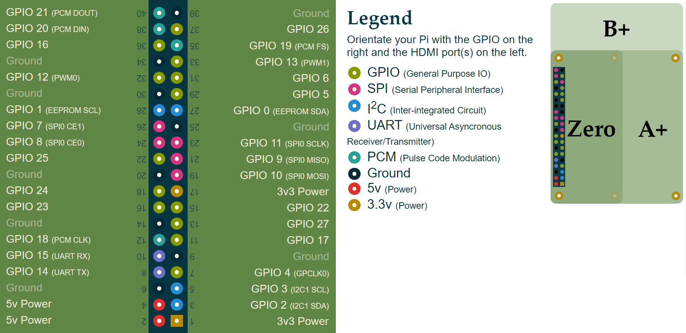

Chytrý zvonek + schránka s vlajkou
==================================

Cílem je vytvořit prototyp domovního zvonku pro smart home, včetně kamery.

Veškerá komunikace přes internet probíhá přes cloudový MQTT server (broker) HiveMQ, který je zdarma:

| Adresa            | mqtt.flespi.io                                      |
|-------------------|-----------------------------------------------------|
| Port (Web Socket) | 443                                                 |
| SSL               | Ano                                                 |
| Username          | tMkzlICVonkEjrtHJOzM9ObNoV1fq3fHFq5OWxAbKIFRXZpvBO7yq69DQ0I6ROCk |
| Heslo (prázdné)   |                                                     |

Čísla pinů na Raspberry PI:

Máte k dispozici
----------------

-   2x Reproduktor

    Reproduktor dokáže přehrát zvuk zvonění.
    Ovládá se přes MQTT topic `/smart-doorbell/sound/1` nebo `/smart-doorbell/sound/2`,
    podle toho, ke kterému zvukovému výstupu je reproduktor připojen.

    Tedy možné topicy + zpráva (kterou je třeba do nich zaslat):
        -   `/smart-doorbell/sound/1` <- `ring`
        -   `/smart-doorbell/sound/2` <- `ring`

    První reproduktor se připojuje na audio jack 3.5" na Raspberry Pi.
    Druhý reproduktor se připojuje do USB zvukové karty SYBA.

-   Sada 2 reproduktorů a mikrofonů

    Určeno pro domovní telefon, například ve výškovém domě.

    Komunikace se dá ustavit odesláním zprávy na topic: `/smart-doorbell/sound` <- `phone-call-start`
    K ukončení komunikace dojde buď automaticky po 30 sekundách (lze do budoucna nakonfigurovat)
    nebo odesláním zprávy na topic: `/smart-doorbell/sound` <- `phone-call-stop`

    Reproduktory se zapojují dle bodu výše, první mikrofon se zapojuje do USB konektory na Raspberry Pi,
    druhý konektor se zapojuje do USB zvukové karty SYBA.

-   Klasická tlačítka (až 5 kusů)

    Ovládají se přes MQTT topic `/smart-doorbell/button/<i>ČÍSLO_PINU_NA_RASPBERRY_PI</i>`, kam je tlačítko připojeno.

    Možné piny: `A5`, `A4`, `A3`, `A2`, `A1`, `A0`

    Tedy možné topicy + zpráva (která z nich příchází):
        -   `/smart-doorbell/button/9` -> `pressed`
        -   `/smart-doorbell/button/10` -> `pressed`
        -   `/smart-doorbell/button/22` -> `pressed`
        -   `/smart-doorbell/button/27` -> `pressed`
        -   `/smart-doorbell/button/17` -> `pressed`
        -   `/smart-doorbell/button/9` -> `released`
        -   `/smart-doorbell/button/10` -> `released`
        -   `/smart-doorbell/button/22` -> `released`
        -   `/smart-doorbell/button/27` -> `released`
        -   `/smart-doorbell/button/17` -> `released`

-   Kamera pro domovní video telefon.

    Vyfocení fotky: `/smart-doorbell/photo` <- `snapshot`

    Výsledná fotka je uploadovná na cloudovou službu ImgBB a její adresa je odeslána do topicu:
    `/smart-doorbell/photo/taken` -> `https://imgbb.com/i/3256987265.jpg`

- Pravidelné focení fotek po určitou dobu
    -   `/smart-doorbell/photo` <- `recording-start`
    -   `/smart-doorbell/photo` <- `recording-stop`
    -   `/smart-doorbell/photo/taken` -> `https://imgbb.com/i/3256987265.jpg`

- Rozsvícení LED
    -   `/smart-doorbell/led/7` <- `on
    -   `/smart-doorbell/led/8` <- `on`
    -   `/smart-doorbell/led/25` <- "on"
    -   `/smart-doorbell/led/24` <- "on"
    -   `/smart-doorbell/led/23` <- "on"
    -   `/smart-doorbell/led/7` <- "off"
    -   `/smart-doorbell/led/8` <- "off"
    -   `/smart-doorbell/led/25` <- "off"
    -   `/smart-doorbell/led/24` <- "off"
    -   `/smart-doorbell/led/23` <- "off"

- Blikání LED
    -   `/smart-doorbell/led/7` <- `blink`
    -   `/smart-doorbell/led/8` <- `blink`
    -   `/smart-doorbell/led/25` <- `blink`
    -   `/smart-doorbell/led/24` <- `blink`
    -   `/smart-doorbell/led/23` <- `blink`
    -   `/smart-doorbell/led/7` <- `stop`
    -   `/smart-doorbell/led/8` <- `stop`
    -   `/smart-doorbell/led/25` <- `stop`
    -   `/smart-doorbell/led/24` <- `stop`
    -   `/smart-doorbell/led/23` <- `stop`
